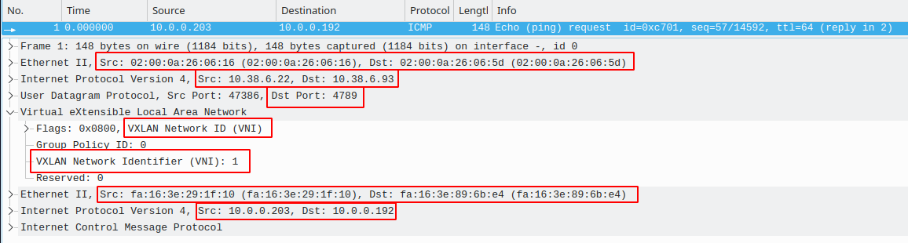

= HW2: Popis konfigurace virtualizace a sítě nastavené pomocí OpenStack

== Přehled instancí

Máme k dispozici konfiguraci s dvěmi instancemi `demo1` a `demo2` v síti `demo-net`. +

|===
| Instance | Hostitelský node | ID | Lokální název v rámci hypervizoru | IP adresa v rámci `demo-net`

| `demo1`
| `cmp-1`
| `7b44c892-550f-434a-b8c7-b30b70162bd3`
| `instance-00000001`
| `10.0.0.203`

| `demo2`
| `cmp-2`
| `40a52922-4368-4f15-ae49-672f29eee7a7`
| `instance-00000002`
| `10.0.0.192`

|===

Níže můžeme vidět instance ve službě Horizon.

== XML deskriptory VM

XML deskriptor budeme hledat v kontejneru `nova_libvirt` na hostitelských nodech instancí.

Pro přístup do kontejneru na obou hostitelských nodech využijeme následující příkaz.

[source, bash]
----
docker exec -it nova_libvirt bash -i
----

V rámci kontejneru `nova_libvirt` na obou nodech ověříme běžící instance.

[source, bash]
----
virsh list
----

=== demo1

Výstup z virsh list:
----
(nova-libvirt)[root@pondepe1-cv3-cmp-1 /]# virsh list
 Id   Name                State
-----------------------------------
 1    instance-00000001   running
----

Vypíšeme si XML deskriptor dané instance (nachází se v souboru `/etc/libvirt/qemu/instance-00000001.xml`):

[source, bash]
----
virsh dumpxml instance-00000001
----

----
(nova-libvirt)[root@pondepe1-cv3-cmp-1 /]# virsh dumpxml instance-00000001
<domain type='kvm' id='1'>
  <name>instance-00000001</name> #<1>
  <uuid>7b44c892-550f-434a-b8c7-b30b70162bd3</uuid> #<2>
  <metadata>
    <nova:instance xmlns:nova="http://openstack.org/xmlns/libvirt/nova/1.0">
      <nova:package version="22.2.1"/>
      <nova:name>demo1</nova:name>
      <nova:creationTime>2021-04-14 13:42:19</nova:creationTime>
      <nova:flavor name="m1.tiny">
        <nova:memory>512</nova:memory>
        <nova:disk>1</nova:disk>
        <nova:swap>0</nova:swap>
        <nova:ephemeral>0</nova:ephemeral>
        <nova:vcpus>1</nova:vcpus>
      </nova:flavor>
      <nova:owner>
        <nova:user uuid="26a80ea924954ff29ed3ff6df30d224d">admin</nova:user>
        <nova:project uuid="2763d47c0d9f46f4bffdacf833473520">admin</nova:project>
      </nova:owner>
      <nova:root type="image" uuid="752a9ca3-8ec7-4fa6-af2e-6725fcdf334f"/>
    </nova:instance>
  </metadata>
  <memory unit='KiB'>524288</memory>
  <currentMemory unit='KiB'>524288</currentMemory>
  <vcpu placement='static'>1</vcpu>
  <cputune>
    <shares>1024</shares>
  </cputune>
  <resource>
    <partition>/machine</partition>
  </resource>
  <sysinfo type='smbios'>
    <system>
      <entry name='manufacturer'>OpenStack Foundation</entry>
      <entry name='product'>OpenStack Nova</entry>
      <entry name='version'>22.2.1</entry>
      <entry name='serial'>7b44c892-550f-434a-b8c7-b30b70162bd3</entry>
      <entry name='uuid'>7b44c892-550f-434a-b8c7-b30b70162bd3</entry>
      <entry name='family'>Virtual Machine</entry>
    </system>
  </sysinfo>
  <os>
    <type arch='x86_64' machine='pc-i440fx-4.2'>hvm</type>
    <boot dev='hd'/>
    <smbios mode='sysinfo'/>
  </os>
  <features>
    <acpi/>
    <apic/>
  </features>
  <cpu mode='custom' match='exact' check='full'>
    <model fallback='forbid'>Cascadelake-Server</model>
    <vendor>Intel</vendor>
    <topology sockets='1' cores='1' threads='1'/>
    <feature policy='require' name='ss'/>
    <feature policy='require' name='vmx'/>
    <feature policy='require' name='hypervisor'/>
    <feature policy='require' name='tsc_adjust'/>
    <feature policy='require' name='pku'/>
    <feature policy='require' name='md-clear'/>
    <feature policy='require' name='arch-capabilities'/>
    <feature policy='require' name='ibpb'/>
    <feature policy='require' name='amd-ssbd'/>
    <feature policy='require' name='skip-l1dfl-vmentry'/>
    <feature policy='require' name='pschange-mc-no'/>
    <feature policy='disable' name='invpcid'/>
    <feature policy='disable' name='avx512vnni'/>
    <feature policy='disable' name='pdpe1gb'/>
    <feature policy='disable' name='mpx'/>
  </cpu>
  <clock offset='utc'>
    <timer name='pit' tickpolicy='delay'/>
    <timer name='rtc' tickpolicy='catchup'/>
    <timer name='hpet' present='no'/>
  </clock>
  <on_poweroff>destroy</on_poweroff>
  <on_reboot>restart</on_reboot>
  <on_crash>destroy</on_crash>
  <devices>
    <emulator>/usr/bin/qemu-system-x86_64</emulator>
    <disk type='file' device='disk'>
      <driver name='qemu' type='qcow2' cache='none'/>
      <source file='/var/lib/nova/instances/7b44c892-550f-434a-b8c7-b30b70162bd3/disk' index='1'/>
      <backingStore type='file' index='2'>
        <format type='raw'/>
        <source file='/var/lib/nova/instances/_base/5f04f4b7ab4791eb4f00f49e0c63be61417e8069'/>
        <backingStore/>
      </backingStore>
      <target dev='vda' bus='virtio'/>
      <alias name='virtio-disk0'/>
      <address type='pci' domain='0x0000' bus='0x00' slot='0x04' function='0x0'/>
    </disk>
    <controller type='usb' index='0' model='piix3-uhci'>
(nova-libvirt)[root@pondepe1-cv3-cmp-1 /]# virsh dumpxml instance-00000001
<domain type='kvm' id='1'>
  <name>instance-00000001</name>
  <uuid>7b44c892-550f-434a-b8c7-b30b70162bd3</uuid>
  <metadata>
    <nova:instance xmlns:nova="http://openstack.org/xmlns/libvirt/nova/1.0">
      <nova:package version="22.2.1"/>
      <nova:name>demo1</nova:name>
      <nova:creationTime>2021-04-14 13:42:19</nova:creationTime>
      <nova:flavor name="m1.tiny">
        <nova:memory>512</nova:memory>
        <nova:disk>1</nova:disk>
        <nova:swap>0</nova:swap>
        <nova:ephemeral>0</nova:ephemeral>
        <nova:vcpus>1</nova:vcpus>
      </nova:flavor>
      <nova:owner>
        <nova:user uuid="26a80ea924954ff29ed3ff6df30d224d">admin</nova:user>
        <nova:project uuid="2763d47c0d9f46f4bffdacf833473520">admin</nova:project>
      </nova:owner>
      <nova:root type="image" uuid="752a9ca3-8ec7-4fa6-af2e-6725fcdf334f"/>
    </nova:instance>
  </metadata>
  <memory unit='KiB'>524288</memory>
  <currentMemory unit='KiB'>524288</currentMemory>
  <vcpu placement='static'>1</vcpu>
  <cputune>
    <shares>1024</shares>
  </cputune>
  <resource>
    <partition>/machine</partition>
  </resource>
  <sysinfo type='smbios'>
    <system>
      <entry name='manufacturer'>OpenStack Foundation</entry>
      <entry name='product'>OpenStack Nova</entry>
      <entry name='version'>22.2.1</entry>
      <entry name='serial'>7b44c892-550f-434a-b8c7-b30b70162bd3</entry>
      <entry name='uuid'>7b44c892-550f-434a-b8c7-b30b70162bd3</entry>
      <entry name='family'>Virtual Machine</entry>
    </system>
  </sysinfo>
  <os>
    <type arch='x86_64' machine='pc-i440fx-4.2'>hvm</type>
    <boot dev='hd'/>
    <smbios mode='sysinfo'/>
  </os>
  <features>
    <acpi/>
    <apic/>
  </features>
  <cpu mode='custom' match='exact' check='full'>
    <model fallback='forbid'>Cascadelake-Server</model>
    <vendor>Intel</vendor>
    <topology sockets='1' cores='1' threads='1'/>
    <feature policy='require' name='ss'/>
    <feature policy='require' name='vmx'/>
    <feature policy='require' name='hypervisor'/>
    <feature policy='require' name='tsc_adjust'/>
    <feature policy='require' name='pku'/>
    <feature policy='require' name='md-clear'/>
    <feature policy='require' name='arch-capabilities'/>
    <feature policy='require' name='ibpb'/>
    <feature policy='require' name='amd-ssbd'/>
    <feature policy='require' name='skip-l1dfl-vmentry'/>
    <feature policy='require' name='pschange-mc-no'/>
    <feature policy='disable' name='invpcid'/>
    <feature policy='disable' name='avx512vnni'/>
    <feature policy='disable' name='pdpe1gb'/>
    <feature policy='disable' name='mpx'/>
  </cpu>
  <clock offset='utc'>
    <timer name='pit' tickpolicy='delay'/>
    <timer name='rtc' tickpolicy='catchup'/>
    <timer name='hpet' present='no'/>
  </clock>
  <on_poweroff>destroy</on_poweroff>
  <on_reboot>restart</on_reboot>
  <on_crash>destroy</on_crash>
  <devices>
    <emulator>/usr/bin/qemu-system-x86_64</emulator>
    <disk type='file' device='disk'>
      <driver name='qemu' type='qcow2' cache='none'/>
      <source file='/var/lib/nova/instances/7b44c892-550f-434a-b8c7-b30b70162bd3/disk' index='1'/>
      <backingStore type='file' index='2'>
        <format type='raw'/>
        <source file='/var/lib/nova/instances/_base/5f04f4b7ab4791eb4f00f49e0c63be61417e8069'/>
        <backingStore/>
      </backingStore>
      <target dev='vda' bus='virtio'/>
      <alias name='virtio-disk0'/>
      <address type='pci' domain='0x0000' bus='0x00' slot='0x04' function='0x0'/>
    </disk>
    <controller type='usb' index='0' model='piix3-uhci'>
      <alias name='usb'/>
      <address type='pci' domain='0x0000' bus='0x00' slot='0x01' function='0x2'/>
    </controller>
    <controller type='pci' index='0' model='pci-root'>
      <alias name='pci.0'/>
    </controller>
    <interface type='bridge'>
      <mac address='fa:16:3e:29:1f:10'/>
      <source bridge='qbr7186b30e-cb'/>
      <target dev='tap7186b30e-cb'/> #<3>
      <model type='virtio'/>
      <mtu size='1450'/>
      <alias name='net0'/>
      <address type='pci' domain='0x0000' bus='0x00' slot='0x03' function='0x0'/>
    </interface>
    <serial type='pty'>
      <source path='/dev/pts/2'/>
      <log file='/var/lib/nova/instances/7b44c892-550f-434a-b8c7-b30b70162bd3/console.log' append='off'/>
      <target type='isa-serial' port='0'>
        <model name='isa-serial'/>
      </target>
      <alias name='serial0'/>
    </serial>
    <console type='pty' tty='/dev/pts/2'>
      <source path='/dev/pts/2'/>
      <log file='/var/lib/nova/instances/7b44c892-550f-434a-b8c7-b30b70162bd3/console.log' append='off'/>
      <target type='serial' port='0'/>
      <alias name='serial0'/>
    </console>
    <input type='tablet' bus='usb'>
      <alias name='input0'/>
      <address type='usb' bus='0' port='1'/>
    </input>
    <input type='mouse' bus='ps2'>
      <alias name='input1'/>
    </input>
    <input type='keyboard' bus='ps2'>
      <alias name='input2'/>
    </input>
    <graphics type='vnc' port='5900' autoport='yes' listen='10.38.6.22'>
      <listen type='address' address='10.38.6.22'/>
    </graphics>
    <video>
      <model type='cirrus' vram='16384' heads='1' primary='yes'/>
      <alias name='video0'/>
      <address type='pci' domain='0x0000' bus='0x00' slot='0x02' function='0x0'/>
    </video>
    <memballoon model='virtio'>
      <stats period='10'/>
      <alias name='balloon0'/>
      <address type='pci' domain='0x0000' bus='0x00' slot='0x05' function='0x0'/>
    </memballoon>
    <rng model='virtio'>
      <backend model='random'>/dev/urandom</backend>
      <alias name='rng0'/>
      <address type='pci' domain='0x0000' bus='0x00' slot='0x06' function='0x0'/>
    </rng>
  </devices>
  <seclabel type='dynamic' model='dac' relabel='yes'>
    <label>+42436:+42436</label>
    <imagelabel>+42436:+42436</imagelabel>
  </seclabel>
</domain>
----

<1> Lokální název instance `demo1` na hypervizoru
<2> ID instance `demo1`
<3> Rozhraní instance `demo1`

=== demo2

Výstup z virsh list:
----
(nova-libvirt)[root@pondepe1-cv3-cmp-2 /]# virsh list
 Id   Name                State
-----------------------------------
 1    instance-00000002   running
----

Vypíšeme si XML deskriptor dané instance (nachází se v souboru `/etc/libvirt/qemu/instance-00000002.xml`):

[source, bash]
----
virsh dumpxml instance-00000002
----

----
nova-libvirt)[root@pondepe1-cv3-cmp-2 /]# virsh dumpxml instance-00000002            
<domain type='kvm' id='1'>
  <name>instance-00000002</name>
  <uuid>40a52922-4368-4f15-ae49-672f29eee7a7</uuid>
  <metadata>
    <nova:instance xmlns:nova="http://openstack.org/xmlns/libvirt/nova/1.0">
      <nova:package version="22.2.1"/>
      <nova:name>demo2</nova:name>
      <nova:creationTime>2021-04-03 16:35:33</nova:creationTime>
      <nova:flavor name="m1.tiny">
        <nova:memory>512</nova:memory>
        <nova:disk>1</nova:disk>
        <nova:swap>0</nova:swap>
        <nova:ephemeral>0</nova:ephemeral>
        <nova:vcpus>1</nova:vcpus>
      </nova:flavor>
      <nova:owner>
        <nova:user uuid="26a80ea924954ff29ed3ff6df30d224d">admin</nova:user>
        <nova:project uuid="2763d47c0d9f46f4bffdacf833473520">admin</nova:project>
      </nova:owner>
      <nova:root type="image" uuid="752a9ca3-8ec7-4fa6-af2e-6725fcdf334f"/>
    </nova:instance>
  </metadata>
  <memory unit='KiB'>524288</memory>
  <currentMemory unit='KiB'>524288</currentMemory>
  <vcpu placement='static'>1</vcpu>
  <cputune>
    <shares>1024</shares>
  </cputune>
  <resource>
    <partition>/machine</partition>
  </resource>
  <sysinfo type='smbios'>
    <system>
      <entry name='manufacturer'>OpenStack Foundation</entry>
      <entry name='product'>OpenStack Nova</entry>
      <entry name='version'>22.2.1</entry>
      <entry name='serial'>40a52922-4368-4f15-ae49-672f29eee7a7</entry>
      <entry name='uuid'>40a52922-4368-4f15-ae49-672f29eee7a7</entry>
      <entry name='family'>Virtual Machine</entry>
    </system>
  </sysinfo>
  <os>
    <type arch='x86_64' machine='pc-i440fx-4.2'>hvm</type>
    <boot dev='hd'/>
    <smbios mode='sysinfo'/>
  </os>
  <features>
    <acpi/>
    <apic/>
  </features>
  <cpu mode='custom' match='exact' check='full'>
    <model fallback='forbid'>Cascadelake-Server</model>
    <vendor>Intel</vendor>
    <topology sockets='1' cores='1' threads='1'/>
    <feature policy='require' name='ss'/>
    <feature policy='require' name='vmx'/>
    <feature policy='require' name='hypervisor'/>
    <feature policy='require' name='tsc_adjust'/>
    <feature policy='require' name='pku'/>
    <feature policy='require' name='md-clear'/>
    <feature policy='require' name='arch-capabilities'/>
    <feature policy='require' name='ibpb'/>
    <feature policy='require' name='amd-ssbd'/>
    <feature policy='require' name='skip-l1dfl-vmentry'/>
    <feature policy='require' name='pschange-mc-no'/>
    <feature policy='disable' name='invpcid'/>
    <feature policy='disable' name='avx512vnni'/>
    <feature policy='disable' name='pdpe1gb'/>
    <feature policy='disable' name='mpx'/>
  </cpu>
  <clock offset='utc'>
    <timer name='pit' tickpolicy='delay'/>
    <timer name='rtc' tickpolicy='catchup'/>
    <timer name='hpet' present='no'/>
  </clock>
  <on_poweroff>destroy</on_poweroff>
  <on_reboot>restart</on_reboot>
  <on_crash>destroy</on_crash>
  <devices>
    <emulator>/usr/bin/qemu-system-x86_64</emulator>
    <disk type='file' device='disk'>
      <driver name='qemu' type='qcow2' cache='none'/>
      <source file='/var/lib/nova/instances/40a52922-4368-4f15-ae49-672f29eee7a7/disk' index='1'/>
      <backingStore type='file' index='2'>
        <format type='raw'/>
        <source file='/var/lib/nova/instances/_base/5f04f4b7ab4791eb4f00f49e0c63be61417e8069'/>
        <backingStore/>
      </backingStore>
      <target dev='vda' bus='virtio'/>
      <alias name='virtio-disk0'/>
      <address type='pci' domain='0x0000' bus='0x00' slot='0x04' function='0x0'/>
    </disk>
    <controller type='usb' index='0' model='piix3-uhci'>
      <alias name='usb'/>
      <address type='pci' domain='0x0000' bus='0x00' slot='0x01' function='0x2'/>
    </controller>
    <controller type='pci' index='0' model='pci-root'>
      <alias name='pci.0'/>
    </controller>
    <interface type='bridge'>
      <mac address='fa:16:3e:89:6b:e4'/>
      <source bridge='qbrea12809b-b7'/>
      <target dev='tapea12809b-b7'/> #<3>
      <model type='virtio'/>
      <mtu size='1450'/>
      <alias name='net0'/>
      <address type='pci' domain='0x0000' bus='0x00' slot='0x03' function='0x0'/>
    </interface>
    <serial type='pty'>
      <source path='/dev/pts/1'/>
      <log file='/var/lib/nova/instances/40a52922-4368-4f15-ae49-672f29eee7a7/console.log' append='off'/>
      <target type='isa-serial' port='0'>
        <model name='isa-serial'/>
      </target>
      <alias name='serial0'/>
    </serial>
    <console type='pty' tty='/dev/pts/1'>
      <source path='/dev/pts/1'/>
      <log file='/var/lib/nova/instances/40a52922-4368-4f15-ae49-672f29eee7a7/console.log' append='off'/>
      <target type='serial' port='0'/>
      <alias name='serial0'/>
    </console>
    <input type='tablet' bus='usb'>
      <alias name='input0'/>
      <address type='usb' bus='0' port='1'/>
    </input>
    <input type='mouse' bus='ps2'>
      <alias name='input1'/>
    </input>
    <input type='keyboard' bus='ps2'>
      <alias name='input2'/>
    </input>
    <graphics type='vnc' port='5900' autoport='yes' listen='10.38.6.93'>
      <listen type='address' address='10.38.6.93'/>
    </graphics>
    <video>
      <model type='cirrus' vram='16384' heads='1' primary='yes'/>
      <alias name='video0'/>
      <address type='pci' domain='0x0000' bus='0x00' slot='0x02' function='0x0'/>
    </video>
    <memballoon model='virtio'>
      <stats period='10'/>
      <alias name='balloon0'/>
      <address type='pci' domain='0x0000' bus='0x00' slot='0x05' function='0x0'/>
    </memballoon>
    <rng model='virtio'>
      <backend model='random'>/dev/urandom</backend>
      <alias name='rng0'/>
      <address type='pci' domain='0x0000' bus='0x00' slot='0x06' function='0x0'/>
    </rng>
  </devices>
  <seclabel type='dynamic' model='dac' relabel='yes'>
    <label>+42436:+42436</label>
    <imagelabel>+42436:+42436</imagelabel>
  </seclabel>
</domain>
----

<1> Lokální název instance `demo1` na hypervizoru
<2> ID instance `demo2`
<3> Rozhraní instance `demo2`

== Trasování provozu mezi dvěma VM

Zajímá nás provoz na rozhraních instancí `demo1` a `demo2` nalezených v předchozí kapitole, tedy:

|===
| Instance | Rozhraní

| `demo1` | `tap7186b30e-cb`
| `demo2` | `tapea12809b-b7`
|===

=== demo1

Trasování provozu spustíme následujícím příkazem:

[source, bash]
----
tcpdump -i tap7186b30e-cb
----

Log z terminálu:
----
root@pondepe1-cv3-cmp-1:~# tcpdump -vv -i tap7186b30e-cb
tcpdump: listening on tap7186b30e-cb, link-type EN10MB (Ethernet), capture size 262144 bytes
15:47:18.654232 IP (tos 0x0, ttl 64, id 25635, offset 0, flags [DF], proto ICMP (1), length 84)
    10.0.0.203 > 10.0.0.192: ICMP echo request, id 48897, seq 1786, length 64
15:47:18.655473 IP (tos 0x0, ttl 64, id 22023, offset 0, flags [none], proto ICMP (1), length 84)
    10.0.0.192 > 10.0.0.203: ICMP echo reply, id 48897, seq 1786, length 64
15:47:19.655023 IP (tos 0x0, ttl 64, id 25750, offset 0, flags [DF], proto ICMP (1), length 84)
    10.0.0.203 > 10.0.0.192: ICMP echo request, id 48897, seq 1787, length 64
15:47:19.656178 IP (tos 0x0, ttl 64, id 22115, offset 0, flags [none], proto ICMP (1), length 84)
    10.0.0.192 > 10.0.0.203: ICMP echo reply, id 48897, seq 1787, length 64
15:47:20.655713 IP (tos 0x0, ttl 64, id 25753, offset 0, flags [DF], proto ICMP (1), length 84)
    10.0.0.203 > 10.0.0.192: ICMP echo request, id 48897, seq 1788, length 64
15:47:20.657267 IP (tos 0x0, ttl 64, id 22249, offset 0, flags [none], proto ICMP (1), length 84)
    10.0.0.192 > 10.0.0.203: ICMP echo reply, id 48897, seq 1788, length 64
15:47:21.656506 IP (tos 0x0, ttl 64, id 25795, offset 0, flags [DF], proto ICMP (1), length 84)
    10.0.0.203 > 10.0.0.192: ICMP echo request, id 48897, seq 1789, length 64
15:47:21.659082 IP (tos 0x0, ttl 64, id 22346, offset 0, flags [none], proto ICMP (1), length 84)
    10.0.0.192 > 10.0.0.203: ICMP echo reply, id 48897, seq 1789, length 64
----

=== demo2

Trasování provozu spustíme následujícím příkazem:

[source, bash]
----
tcpdump -i tapea12809b-b7
----

Log z terminálu:
----
root@pondepe1-cv3-cmp-2:~# tcpdump -vv -i tapea12809b-b7
tcpdump: listening on tapea12809b-b7, link-type EN10MB (Ethernet), capture size 262144 bytes
15:47:20.656987 IP (tos 0x0, ttl 64, id 25753, offset 0, flags [DF], proto ICMP (1), length 84)
    10.0.0.203 > 10.0.0.192: ICMP echo request, id 48897, seq 1788, length 64 #<1>
15:47:20.657784 IP (tos 0x0, ttl 64, id 22249, offset 0, flags [none], proto ICMP (1), length 84)
    10.0.0.192 > 10.0.0.203: ICMP echo reply, id 48897, seq 1788, length 64 #<2>
15:47:21.658622 IP (tos 0x0, ttl 64, id 25795, offset 0, flags [DF], proto ICMP (1), length 84)
    10.0.0.203 > 10.0.0.192: ICMP echo request, id 48897, seq 1789, length 64
15:47:21.659653 IP (tos 0x0, ttl 64, id 22346, offset 0, flags [none], proto ICMP (1), length 84)
    10.0.0.192 > 10.0.0.203: ICMP echo reply, id 48897, seq 1789, length 64
15:47:22.658502 IP (tos 0x0, ttl 64, id 25980, offset 0, flags [DF], proto ICMP (1), length 84)
    10.0.0.203 > 10.0.0.192: ICMP echo request, id 48897, seq 1790, length 64
15:47:22.659988 IP (tos 0x0, ttl 64, id 22453, offset 0, flags [none], proto ICMP (1), length 84)
    10.0.0.192 > 10.0.0.203: ICMP echo reply, id 48897, seq 1790, length 64
15:47:23.658983 IP (tos 0x0, ttl 64, id 26047, offset 0, flags [DF], proto ICMP (1), length 84)
    10.0.0.203 > 10.0.0.192: ICMP echo request, id 48897, seq 1791, length 64
15:47:23.660058 IP (tos 0x0, ttl 64, id 22682, offset 0, flags [none], proto ICMP (1), length 84)
    10.0.0.192 > 10.0.0.203: ICMP echo reply, id 48897, seq 1791, length 64
----

<1> Request z `demo1` (`10.0.0.203`) na `demo2` (`10.0.0.192`)
<2> Response from `demo2` (`10.0.0.192`) na `demo1` (`10.0.0.203`)

=== Shrnutí

V logu můžeme vidět, že monitorovaný provoz mezi rozhraními `tap7186b30e-cb` a `tapea12809b-b7` je bez VXLAN.

Screenshot zachycující provoz:

== Trasování provozu tunelovaného pomocí VXLAN mezi dvěma nody

=== Bez využití Wireshark

Cílem je trasovat provoz mezi dvěma nody na podkladové (fyzické) síti za využití VXLAN.

Na nodech `cmp-1` a `cmp-2` spustíme paketový analyzátor tcpudump na rozhraní `ens3`.

[source, bash]
----
tcpdump -n -i ens3 -vv udp
----

Log z terminálu na `cmp-1`:
----
root@pondepe1-cv3-cmp-1:~# tcpdump -n -i ens3 -vv udp
tcpdump: listening on ens3, link-type EN10MB (Ethernet), capture size 262144 bytes
15:27:22.664107 IP (tos 0x0, ttl 64, id 63405, offset 0, flags [DF], proto UDP (17), length 134) #<1>
    10.38.6.22.47386 > 10.38.6.93.4789: [no cksum] VXLAN, flags [I] (0x08), vni 1 #<2>
IP (tos 0x0, ttl 64, id 3808, offset 0, flags [DF], proto ICMP (1), length 84)
    10.0.0.203 > 10.0.0.192: ICMP echo request, id 48897, seq 591, length 64 #<3>
15:27:22.665096 IP (tos 0x0, ttl 64, id 44466, offset 0, flags [DF], proto UDP (17), length 134) #<4>
    10.38.6.93.33494 > 10.38.6.22.4789: [no cksum] VXLAN, flags [I] (0x08), vni 1 #<5>
IP (tos 0x0, ttl 64, id 3636, offset 0, flags [none], proto ICMP (1), length 84)
    10.0.0.192 > 10.0.0.203: ICMP echo reply, id 48897, seq 591, length 64 #<6>
15:27:23.665479 IP (tos 0x0, ttl 64, id 63469, offset 0, flags [DF], proto UDP (17), length 134)
    10.38.6.22.47386 > 10.38.6.93.4789: [no cksum] VXLAN, flags [I] (0x08), vni 1
IP (tos 0x0, ttl 64, id 4036, offset 0, flags [DF], proto ICMP (1), length 84)
    10.0.0.203 > 10.0.0.192: ICMP echo request, id 48897, seq 592, length 64
15:27:23.666538 IP (tos 0x0, ttl 64, id 44688, offset 0, flags [DF], proto UDP (17), length 134)
    10.38.6.93.33494 > 10.38.6.22.4789: [no cksum] VXLAN, flags [I] (0x08), vni 1
IP (tos 0x0, ttl 64, id 3875, offset 0, flags [none], proto ICMP (1), length 84)
    10.0.0.192 > 10.0.0.203: ICMP echo reply, id 48897, seq 592, length 64
----

<1> Začátek tunelovaného požadavku.
<2> Komunikace z nodu `cmp-1` na node `cmp-2` tunelovaná pomocí VXLAN. Komunikace probíhá na port 4789 (obvyklý VXLAN port) cílového nodu.
<3> Požadavek z instance `demo1` na instanci `demo2`.
<4> Začátek odpovědi na tunelovaný požadavek.
<5> Komunikace z nodu `cmp-2` na node `cmp-1` tunelovaná pomocí VXLAN.
<6> Požadavek z instance `demo2` na instanci `demo1`.

Log z terminálu na `cmp-2`:
----
root@pondepe1-cv3-cmp-2:~# tcpdump -n -i ens3 -vv udp
tcpdump: listening on ens3, link-type EN10MB (Ethernet), capture size 262144 bytes
15:27:32.674595 IP (tos 0x0, ttl 64, id 64718, offset 0, flags [DF], proto UDP (17), length 134)
    10.38.6.22.47386 > 10.38.6.93.4789: [no cksum] VXLAN, flags [I] (0x08), vni 1
IP (tos 0x0, ttl 64, id 5249, offset 0, flags [DF], proto ICMP (1), length 84)
    10.0.0.203 > 10.0.0.192: ICMP echo request, id 48897, seq 601, length 64
15:27:32.676292 IP (tos 0x0, ttl 64, id 46252, offset 0, flags [DF], proto UDP (17), length 134)
    10.38.6.93.33494 > 10.38.6.22.4789: [no cksum] VXLAN, flags [I] (0x08), vni 1
IP (tos 0x0, ttl 64, id 4759, offset 0, flags [none], proto ICMP (1), length 84)
    10.0.0.192 > 10.0.0.203: ICMP echo reply, id 48897, seq 601, length 64
15:27:33.675319 IP (tos 0x0, ttl 64, id 64935, offset 0, flags [DF], proto UDP (17), length 134)
    10.38.6.22.47386 > 10.38.6.93.4789: [no cksum] VXLAN, flags [I] (0x08), vni 1
IP (tos 0x0, ttl 64, id 5369, offset 0, flags [DF], proto ICMP (1), length 84)
    10.0.0.203 > 10.0.0.192: ICMP echo request, id 48897, seq 602, length 64
15:27:33.676439 IP (tos 0x0, ttl 64, id 46396, offset 0, flags [DF], proto UDP (17), length 134)
    10.38.6.93.33494 > 10.38.6.22.4789: [no cksum] VXLAN, flags [I] (0x08), vni 1
IP (tos 0x0, ttl 64, id 4937, offset 0, flags [none], proto ICMP (1), length 84)
    10.0.0.192 > 10.0.0.203: ICMP echo reply, id 48897, seq 602, length 64
----

Náhled trasování:

=== S využitím Wireshark

Pro trasování je nutné přesměrovat výstup příkazu `tcpdump` spuštěného na příslušném nodu do Wiresharku.

Toho můžeme docílit vzdáleným spuštěním příkazu `tcpdump` za využití ssh.

[source, bash]
----
ssh root@10.38.6.22 tcpdump -U udp -vv -i ens3 -w - | wireshark -k -i -
----

* přepínač `-U` zajistí, že výstup z `tcpdump` je zapsán na `stdout` až po přijetí kompletního paketu.
* `udp` zajistí filtrování dle protokolu (nebude trackováno `ssh`, přes které běží jsme připojeni)
* `-i ens3` nastaví trackování příslušného rozhraní
* poslední `-` před pajpou přesměruje výstup příkazu na "vstupní rozhraní" Wiresharku (dle hodnoty přepínače `-i` při volání CLI Wiresharku)
* `-k` okamžitě spustí Wireshark

Před samotným trasováním si zjistíme informace o rozhraních na `cmp-1`, `cmp-2` a `demo1`, `demo2`.

**Náhled síťových rozhraní na cmp-1**
----
root@pondepe1-cv3-cmp-1:~# ip addr
1: lo: <LOOPBACK,UP,LOWER_UP> mtu 65536 qdisc noqueue state UNKNOWN group default qlen 1000
    link/loopback 00:00:00:00:00:00 brd 00:00:00:00:00:00
    inet 127.0.0.1/8 scope host lo
       valid_lft forever preferred_lft forever
    inet6 ::1/128 scope host
       valid_lft forever preferred_lft forever
2: ens3: <BROADCAST,MULTICAST,UP,LOWER_UP> mtu 1500 qdisc fq_codel state UP group default qlen 1000
    link/ether 02:00:0a:26:06:16 brd ff:ff:ff:ff:ff:ff #<1>
    inet 10.38.6.22/22 brd 10.38.7.255 scope global ens3
       valid_lft forever preferred_lft forever
    inet6 fe80::aff:fe26:616/64 scope link
       valid_lft forever preferred_lft forever

...
----
<1> MAC adresa rozhraní `ens3` na `cmp-1`

**Náhled síťových rozhraní na cmp-2**
----
root@pondepe1-cv3-cmp-2:~# ip addr
1: lo: <LOOPBACK,UP,LOWER_UP> mtu 65536 qdisc noqueue state UNKNOWN group default qlen 1000
    link/loopback 00:00:00:00:00:00 brd 00:00:00:00:00:00
    inet 127.0.0.1/8 scope host lo
       valid_lft forever preferred_lft forever
    inet6 ::1/128 scope host
       valid_lft forever preferred_lft forever
2: ens3: <BROADCAST,MULTICAST,UP,LOWER_UP> mtu 1500 qdisc fq_codel state UP group default qlen 1000
    link/ether 02:00:0a:26:06:5d brd ff:ff:ff:ff:ff:ff #<1>
    inet 10.38.6.93/22 brd 10.38.7.255 scope global ens3
       valid_lft forever preferred_lft forever
    inet6 fe80::aff:fe26:65d/64 scope link
       valid_lft forever preferred_lft forever

...
----
<1> MAC adresa rozhraní `ens3` na `cmp-2`

**Náhled síťových rozhraní na demo1**

**Náhled síťových rozhraní na demo2**

image::./images/interfaces/demo2.png[,800,]

Na následujícím screenshotu lze vidět probíhající ICMP komunikaci mezi instancemi.

V detailu požadavku pak můžeme vidět následující postupné zapouzdření:

* IP v síti `demo-net`: `10.0.0.203` -> `10.0.0.192`
* Ethernet v síti `demo-net`: `fa:16:3e:29:1f:10` -> `fa:16:3e:89:6b:e4`
* VXLAN: `VNI: 1`
* UDP: `port 4789`
* IP v síti OpenNebula: `10.38.6.22` -> `10.38.6.93`
* Ethernet v síti OpenNebula: `02:00:0a:26:06:16` -> `02:00:0a:26:06:5d`

Detail odpovědi je analogický.

== Diagram síťových prvků, přes které prochází east-west provoz

=== Rozhraní na instancích

Název rozhraní na instaních `demo1` a `demo2` zjistíme příkazem `ip addr`.

image::./images/interfaces/demo2.png[,800,0]

=== Informace o Linux Bridge na nodech (qbr)

Vypíšeme si ethernetové bridge pomoc í příkazu níže.

[source, bash]
----
brctl show
----

**Výstup na cmp-1**
----
root@pondepe1-cv3-cmp-1:~# brctl show
bridge name     bridge id               STP enabled     interfaces
docker0         8000.0242afd10c74       no
qbr7186b30e-cb          8000.4edb852d263a       no              qvb7186b30e-cb #<1>
                                                        tap7186b30e-cb #<2>
----
<1> Linux Bridge tap port: `qvb7186b30e-cb`
<2> Linux Bridge qvb port: `tap7186b30e-cb`

**Výstup na cmp-2**
----
root@pondepe1-cv3-cmp-2:~# brctl show
bridge name     bridge id               STP enabled     interfaces
docker0         8000.0242653f7b86       no
qbrea12809b-b7          8000.b64be97f2c8a       no              qvbea12809b-b7 #<1>
                                                        tapea12809b-b7 #<2>
----
<1> Linux Bridge tap port: `qvbea12809b-b7`
<2> Linux Bridge qvb port: `tapea12809b-b7`

Získáme názvy Linux Bridgů.

**Výstup na cmp-1**
----
root@pondepe1-cv3-cmp-1:~# ip addr | grep 'qbr'
11: qbr7186b30e-cb: <BROADCAST,MULTICAST,UP,LOWER_UP> mtu 1450 qdisc noqueue state UP group default qlen 1000 #<1>
13: qvb7186b30e-cb@qvo7186b30e-cb: <BROADCAST,MULTICAST,UP,LOWER_UP> mtu 1450 qdisc noqueue master qbr7186b30e-cb state UP group default qlen 1000
14: tap7186b30e-cb: <BROADCAST,MULTICAST,UP,LOWER_UP> mtu 1450 qdisc fq_codel master qbr7186b30e-cb state UNKNOWN group default qlen 1000
----

<1> Název bridge: `qbr7186b30e-cb`

**Výstup na cmp-2**
----
9: qbrea12809b-b7: <BROADCAST,MULTICAST,UP,LOWER_UP> mtu 1450 qdisc noqueue state UP group default qlen 1000 #<1>
11: qvbea12809b-b7@qvoea12809b-b7: <BROADCAST,MULTICAST,UP,LOWER_UP> mtu 1450 qdisc noqueue master qbrea12809b-b7 state UP group default qlen 1000
12: tapea12809b-b7: <BROADCAST,MULTICAST,UP,LOWER_UP> mtu 1450 qdisc fq_codel master qbrea12809b-b7 state UNKNOWN group default qlen 1000
----

<1> Název bridge: `qbrea12809b-b7`

=== Informace o OVS Integration Bridge na nodech (br-int)

Přepneme se do OVS kontejneru a vypíšeme si informace o integration bridgi.

[source, bash]
----
docker exec -it openvswitch_vswitchd bash -i
ovs-ofctl show br-int
----

**Výstup na cmp-1**
----
(openvswitch-vswitchd)[root@pondepe1-cv3-cmp-1 /]# ovs-ofctl show br-int
OFPT_FEATURES_REPLY (xid=0x2): dpid:00007aa7d11e3d4b
n_tables:254, n_buffers:0
capabilities: FLOW_STATS TABLE_STATS PORT_STATS QUEUE_STATS ARP_MATCH_IP
actions: output enqueue set_vlan_vid set_vlan_pcp strip_vlan mod_dl_src mod_dl_dst mod_nw_src mod_nw_dst mod_nw_tos mod_tp_src mod_tp_dst
 1(patch-tun): addr:32:4a:4a:8c:34:7e #<1>
     config:     0
     state:      0
     speed: 0 Mbps now, 0 Mbps max
 3(qvo7186b30e-cb): addr:56:1b:9d:0a:10:99 #<2>
     config:     0
     state:      0
     current:    10GB-FD COPPER
     speed: 10000 Mbps now, 0 Mbps max
 LOCAL(br-int): addr:7a:a7:d1:1e:3d:4b #<3>
     config:     PORT_DOWN
     state:      LINK_DOWN
     speed: 0 Mbps now, 0 Mbps max
OFPT_GET_CONFIG_REPLY (xid=0x4): frags=normal miss_send_len=0
----
<1> MAC adresa patch-run: `32:4a:4a:8c:34:7e`
<2> qvo port: `qvo7186b30e-cb`
<3> MAC adresa bridge: `7a:a7:d1:1e:3d:4b`

**Výstup na cmp-2**
----
(openvswitch-vswitchd)[root@pondepe1-cv3-cmp-2 /]# ovs-ofctl show br-int
OFPT_FEATURES_REPLY (xid=0x2): dpid:00001e16fcea8c43
n_tables:254, n_buffers:0
capabilities: FLOW_STATS TABLE_STATS PORT_STATS QUEUE_STATS ARP_MATCH_IP
actions: output enqueue set_vlan_vid set_vlan_pcp strip_vlan mod_dl_src mod_dl_dst mod_nw_src mod_nw_dst mod_nw_tos mod_tp_src mod_tp_dst
 1(patch-tun): addr:a6:a8:6f:9b:fb:ac #<1>
     config:     0
     state:      0
     speed: 0 Mbps now, 0 Mbps max
 2(qvoea12809b-b7): addr:da:ba:87:e7:e6:fe #<2>
     config:     0
     state:      0
     current:    10GB-FD COPPER
     speed: 10000 Mbps now, 0 Mbps max
 LOCAL(br-int): addr:1e:16:fc:ea:8c:43 #<3>
     config:     PORT_DOWN
     state:      LINK_DOWN
     speed: 0 Mbps now, 0 Mbps max
OFPT_GET_CONFIG_REPLY (xid=0x4): frags=normal miss_send_len=0
----
<1> MAC adresa patch-run: `a6:a8:6f:9b:fb:ac`
<2> qvo port: `qvoea12809b-b7`
<3> MAC adresa bridge: `1e:16:fc:ea:8c:43`

=== Informace o OVS Tunnel Bridge na nodech (br-tun)

V rámci OVS kontejneru si vypíšeme informace o tunnel bridgi.

[source, bash]
----
ovs-ofctl show br-tun
----

**Výstup na cmp-1**
----
(openvswitch-vswitchd)[root@pondepe1-cv3-cmp-1 /]# ovs-ofctl show br-tun
OFPT_FEATURES_REPLY (xid=0x2): dpid:00006a9584b2da41
n_tables:254, n_buffers:0
capabilities: FLOW_STATS TABLE_STATS PORT_STATS QUEUE_STATS ARP_MATCH_IP
actions: output enqueue set_vlan_vid set_vlan_pcp strip_vlan mod_dl_src mod_dl_dst mod_nw_src mod_nw_dst mod_nw_tos mod_tp_src mod_tp_dst
 1(patch-int): addr:da:06:30:40:4f:b3 #<1>
     config:     0
     state:      0
     speed: 0 Mbps now, 0 Mbps max
 4(vxlan-0a260600): addr:12:01:5d:1f:2c:eb
     config:     0
     state:      0
     speed: 0 Mbps now, 0 Mbps max
 5(vxlan-0a26065d): addr:9e:68:3f:27:ca:3c
     config:     0
     state:      0
     speed: 0 Mbps now, 0 Mbps max
 LOCAL(br-tun): addr:6a:95:84:b2:da:41 #<2>
     config:     PORT_DOWN
     state:      LINK_DOWN
     speed: 0 Mbps now, 0 Mbps max
OFPT_GET_CONFIG_REPLY (xid=0x4): frags=normal miss_send_len=0
----
<1> MAC adresa patch-int: `da:06:30:40:4f:b3`
<2> MAC adresa bridge: `6a:95:84:b2:da:41`

**Výstup na cmp-2**
----
(openvswitch-vswitchd)[root@pondepe1-cv3-cmp-2 /]# ovs-ofctl show br-tun
OFPT_FEATURES_REPLY (xid=0x2): dpid:0000fa057b9f514e
n_tables:254, n_buffers:0
capabilities: FLOW_STATS TABLE_STATS PORT_STATS QUEUE_STATS ARP_MATCH_IP
actions: output enqueue set_vlan_vid set_vlan_pcp strip_vlan mod_dl_src mod_dl_dst mod_nw_src mod_nw_dst mod_nw_tos mod_tp_src mod_tp_dst
 1(patch-int): addr:ba:7e:15:21:9a:62 #<1>
     config:     0
     state:      0
     speed: 0 Mbps now, 0 Mbps max
 2(vxlan-0a260600): addr:72:b0:76:2b:2f:77
     config:     0
     state:      0
     speed: 0 Mbps now, 0 Mbps max
 4(vxlan-0a260616): addr:9a:f1:bf:50:1e:7d
     config:     0
     state:      0
     speed: 0 Mbps now, 0 Mbps max
 LOCAL(br-tun): addr:fa:05:7b:9f:51:4e #<2>
     config:     PORT_DOWN
     state:      LINK_DOWN
     speed: 0 Mbps now, 0 Mbps max
OFPT_GET_CONFIG_REPLY (xid=0x4): frags=normal miss_send_len=0
----
<1> MAC adresa patch-int: `ba:7e:15:21:9a:62`
<2> MAC adresa bridge: `fa:05:7b:9f:51:4e`

=== Diagram

link:./diagrams/east_west.pdf[East-West diagram]