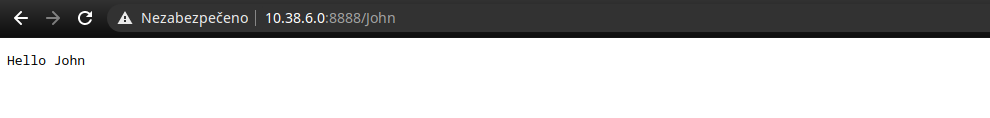
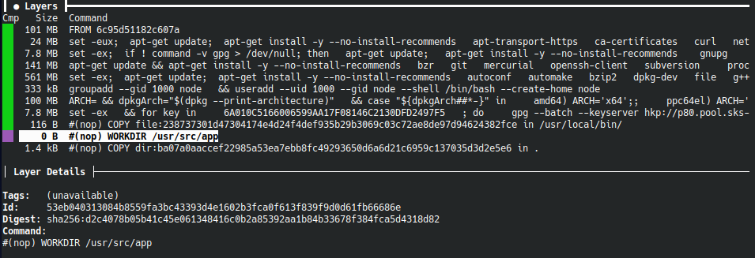
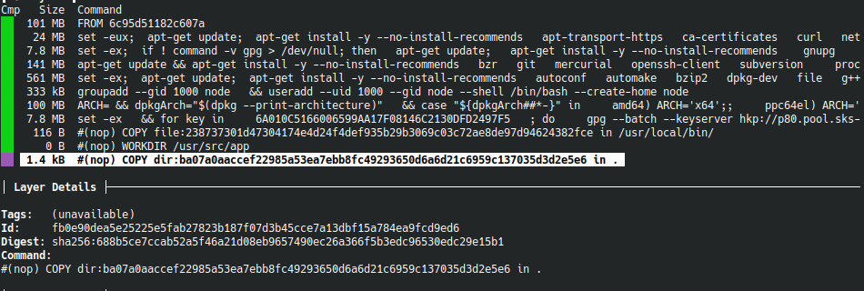
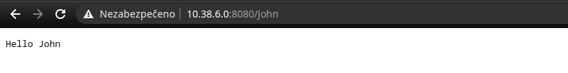

= HW3: Docker a systemd

== Sestavení obrazu s NodeJS HTTP serveru metodou Dockerfile

Na VM nainstalujeme NodeJS.

[source, bash]
----
apt install nodejs
----

Cílem je vytvoření docker image pro jednoduchý HTTP server v NodeJS. Implementace serveru a příslušný Dockerfile jsou dostupné v adresáři `src/`.

Sestavíme docker image z příslušného Dockerfile a pojmenujeme ji např. `nodejs-http-server`.

[source, bash]
----
docker build -t nodejs-http-server .
----

----
root@pondepe1-cv3-ctl:~/hw3# docker build -t nodejs-http-server .
Sending build context to Docker daemon  4.096kB
Step 1/5 : FROM node:14
14: Pulling from library/node
76b8ef87096f: Pull complete
2e2bafe8a0f4: Pull complete
b53ce1fd2746: Pull complete
84a8c1bd5887: Pull complete
7a803dc0b40f: Pull complete
b800e94e7303: Pull complete
8e9f42962912: Pull complete
cc1c1f0d8c86: Pull complete
a42c31ab44dd: Pull complete
Digest: sha256:8eb45f4677c813ad08cef8522254640aa6a1800e75a9c213a0a651f6f3564189
Status: Downloaded newer image for node:14
 ---> d6602e31594f
Step 2/5 : WORKDIR /usr/src/app
 ---> Running in f5de5c44e6d6
Removing intermediate container f5de5c44e6d6
 ---> 0814205bd889
Step 3/5 : COPY . .
 ---> 94b8604ce76c
Step 4/5 : EXPOSE 8080
 ---> Running in fd8b63d1ee44
Removing intermediate container fd8b63d1ee44
 ---> 2658f2c85e36
Step 5/5 : CMD ["node", "server.js"]
 ---> Running in 50c3c0a01a27
Removing intermediate container 50c3c0a01a27
 ---> 3f93da589f90
Successfully built 3f93da589f90
Successfully tagged nodejs-http-server:latest
----

Zkontrolujeme vytvořenou image.

[source, bash]
----
docker images
----

Můžeme vidět, že kromě již dříve přítomných `kolla/` images máme nově podkladovou image `node` (uvedenou v Dockerfile - FROM node:14) a dále sestavenou image `nodejs-http-server`.

----
root@pondepe1-cv3-ctl:~/hw3# docker images
REPOSITORY                                      TAG        IMAGE ID       CREATED              SIZE
nodejs-http-server                              latest     3f93da589f90   About a minute ago   943MB
node                                            14         d6602e31594f   3 weeks ago          943MB
kolla/ubuntu-source-nova-novncproxy             victoria   707bb6f743cf   5 weeks ago          1.12GB
kolla/ubuntu-source-nova-conductor              victoria   74ccf4ea3d11   5 weeks ago          1.03GB
kolla/ubuntu-source-nova-api                    victoria   572ddaa62eed   5 weeks ago          1.03GB
kolla/ubuntu-source-nova-scheduler              victoria   eeca2ce5adac   5 weeks ago          1.03GB
kolla/ubuntu-source-placement-api               victoria   5d3ee61a68da   5 weeks ago          888MB
kolla/ubuntu-source-keystone-fernet             victoria   81507dd812c2   5 weeks ago          879MB
kolla/ubuntu-source-keystone                    victoria   834577a629d6   5 weeks ago          874MB
kolla/ubuntu-source-keystone-ssh                victoria   e7f9b719e306   5 weeks ago          882MB
kolla/ubuntu-source-glance-api                  victoria   fb309e440d35   5 weeks ago          895MB
...
----

Spustíme kontejner tak, aby byla služba dostupná na portu `8888`.

[source, bash]
----
docker run -p 8888:8080 -d nodejs-http-server
----

Zkontrolujeme stav kontejneru.

[source, bash]
----
docker container ls | grep 'nodejs-http-server'
----

----
root@pondepe1-cv3-ctl:~/hw3# docker container ls | grep 'nodejs-http-server'
d4fe4c2f4cbb   nodejs-http-server                                       "docker-entrypoint.s…"   3 minutes ago   Up 3 minutes           0.0.0.0:8888->8080/tcp   flamboyant_poitras
----

Na VM otestujeme, zda služba funguje.

----
root@pondepe1-cv3-ctl:~/hw3# curl -i 127.0.0.1:8888/John
HTTP/1.1 200 OK
Content-Type: text/plain
Access-Control-Allow-Origin: *
Date: Mon, 03 May 2021 09:40:34 GMT
Connection: keep-alive
Keep-Alive: timeout=5
Transfer-Encoding: chunked

Hello John

root@pondepe1-cv3-ctl:~/hw3#curl -i 127.0.0.1:8888/smalljohn
HTTP/1.1 200 OK
Content-Type: text/plain
Access-Control-Allow-Origin: *
Date: Mon, 03 May 2021 09:41:31 GMT
Connection: keep-alive
Keep-Alive: timeout=5
Transfer-Encoding: chunked

Hello smalljohn

root@pondepe1-cv3-ctl:~/hw3# curl -i -X POST 127.0.0.1:8888/post
HTTP/1.1 405 Method Not Allowed
Access-Control-Allow-Origin: *
Date: Mon, 03 May 2021 09:42:19 GMT
Connection: keep-alive
Keep-Alive: timeout=5
Transfer-Encoding: chunked
----

Otestujeme ještě přístup skrze browser.

== Analýza obrazu ve formátu OCI získaného z předchozího kroku pomocí "docker save"

Uložíme image pomocí příkazu docker save.

[source, bash]
----
mkdir images
docker save nodejs-http-server > images/nodejs-http-server.tar
----

Rozbalíme archiv dané image.

[source, bash]
----
tar -xvf nodejs-http-server.tar
----

----
root@pondepe1-cv3-ctl:~/hw3/images# tar -xvf nodejs-http-server.tar
10d19ff10b61200236c12b3990c8ac2bcba8dbda7ad5b74adf95258f42752087/
10d19ff10b61200236c12b3990c8ac2bcba8dbda7ad5b74adf95258f42752087/VERSION
10d19ff10b61200236c12b3990c8ac2bcba8dbda7ad5b74adf95258f42752087/json
10d19ff10b61200236c12b3990c8ac2bcba8dbda7ad5b74adf95258f42752087/layer.tar
20944871b4fe9a88074b871b78788446abbbac1dba48ac9c33e5e7bcbec6b809/
20944871b4fe9a88074b871b78788446abbbac1dba48ac9c33e5e7bcbec6b809/VERSION
20944871b4fe9a88074b871b78788446abbbac1dba48ac9c33e5e7bcbec6b809/json
20944871b4fe9a88074b871b78788446abbbac1dba48ac9c33e5e7bcbec6b809/layer.tar
25a1b23537697707f055a72c06bde4d7d0bf12d589006ffc6edcfe1a0ef72823/
25a1b23537697707f055a72c06bde4d7d0bf12d589006ffc6edcfe1a0ef72823/VERSION
25a1b23537697707f055a72c06bde4d7d0bf12d589006ffc6edcfe1a0ef72823/json
25a1b23537697707f055a72c06bde4d7d0bf12d589006ffc6edcfe1a0ef72823/layer.tar
3f93da589f9047c2b1de7185b7d6661d068f0ae5dc9cfbb32eff64ea41114bfd.json
49d2d2eb3b694b0d6825c48e354abce3d9d502b2a4662d8056060448f8dec92b/
49d2d2eb3b694b0d6825c48e354abce3d9d502b2a4662d8056060448f8dec92b/VERSION
49d2d2eb3b694b0d6825c48e354abce3d9d502b2a4662d8056060448f8dec92b/json
49d2d2eb3b694b0d6825c48e354abce3d9d502b2a4662d8056060448f8dec92b/layer.tar
53eb040313084b8559fa3bc43393d4e1602b3fca0f613f839f9d0d61fb66686e/
53eb040313084b8559fa3bc43393d4e1602b3fca0f613f839f9d0d61fb66686e/VERSION
53eb040313084b8559fa3bc43393d4e1602b3fca0f613f839f9d0d61fb66686e/json
53eb040313084b8559fa3bc43393d4e1602b3fca0f613f839f9d0d61fb66686e/layer.tar
6c95d51182c607ae42ca5fc046a07487bc552f3aa162630cf597689092e8f907/
6c95d51182c607ae42ca5fc046a07487bc552f3aa162630cf597689092e8f907/VERSION
6c95d51182c607ae42ca5fc046a07487bc552f3aa162630cf597689092e8f907/json
6c95d51182c607ae42ca5fc046a07487bc552f3aa162630cf597689092e8f907/layer.tar
7e5297d395c537fd8af7a7d28ed0bbaa8f04b17dde6635dfbd615734ae2dc65b/
7e5297d395c537fd8af7a7d28ed0bbaa8f04b17dde6635dfbd615734ae2dc65b/VERSION
7e5297d395c537fd8af7a7d28ed0bbaa8f04b17dde6635dfbd615734ae2dc65b/json
7e5297d395c537fd8af7a7d28ed0bbaa8f04b17dde6635dfbd615734ae2dc65b/layer.tar
8ac5ed3adc7b589e09b722cb212e30d723c3d7714045cf59bcf52cd1b18f7070/
8ac5ed3adc7b589e09b722cb212e30d723c3d7714045cf59bcf52cd1b18f7070/VERSION
8ac5ed3adc7b589e09b722cb212e30d723c3d7714045cf59bcf52cd1b18f7070/json
8ac5ed3adc7b589e09b722cb212e30d723c3d7714045cf59bcf52cd1b18f7070/layer.tar
a4ea4aedbd758ec7c71be270e71fd14b4beb8b4b8abb98e1afd63dbad5ac0eca/
a4ea4aedbd758ec7c71be270e71fd14b4beb8b4b8abb98e1afd63dbad5ac0eca/VERSION
a4ea4aedbd758ec7c71be270e71fd14b4beb8b4b8abb98e1afd63dbad5ac0eca/json
a4ea4aedbd758ec7c71be270e71fd14b4beb8b4b8abb98e1afd63dbad5ac0eca/layer.tar
fb0e90dea5e25225e5fab27823b187f07d3b45cce7a13dbf15a784ea9fcd9ed6/
fb0e90dea5e25225e5fab27823b187f07d3b45cce7a13dbf15a784ea9fcd9ed6/VERSION
fb0e90dea5e25225e5fab27823b187f07d3b45cce7a13dbf15a784ea9fcd9ed6/json
fb0e90dea5e25225e5fab27823b187f07d3b45cce7a13dbf15a784ea9fcd9ed6/layer.tar
feb849bcfee0fd43be9cf2f55e7f08d7b38c2b384cf646f87dc20eeff7edbfad/
feb849bcfee0fd43be9cf2f55e7f08d7b38c2b384cf646f87dc20eeff7edbfad/VERSION
feb849bcfee0fd43be9cf2f55e7f08d7b38c2b384cf646f87dc20eeff7edbfad/json
feb849bcfee0fd43be9cf2f55e7f08d7b38c2b384cf646f87dc20eeff7edbfad/layer.tar
manifest.json
repositories
----

Vypíšeme si obsah manifes.json.

----
root@pondepe1-cv3-ctl:~/hw3/images# cat manifest.json | python -m json.tool
[
    {
        "Config": "3f93da589f9047c2b1de7185b7d6661d068f0ae5dc9cfbb32eff64ea41114bfd.json",
        "Layers": [
            "6c95d51182c607ae42ca5fc046a07487bc552f3aa162630cf597689092e8f907/layer.tar",
            "49d2d2eb3b694b0d6825c48e354abce3d9d502b2a4662d8056060448f8dec92b/layer.tar",
            "25a1b23537697707f055a72c06bde4d7d0bf12d589006ffc6edcfe1a0ef72823/layer.tar",
            "feb849bcfee0fd43be9cf2f55e7f08d7b38c2b384cf646f87dc20eeff7edbfad/layer.tar",
            "7e5297d395c537fd8af7a7d28ed0bbaa8f04b17dde6635dfbd615734ae2dc65b/layer.tar",
            "a4ea4aedbd758ec7c71be270e71fd14b4beb8b4b8abb98e1afd63dbad5ac0eca/layer.tar",
            "10d19ff10b61200236c12b3990c8ac2bcba8dbda7ad5b74adf95258f42752087/layer.tar",
            "8ac5ed3adc7b589e09b722cb212e30d723c3d7714045cf59bcf52cd1b18f7070/layer.tar",
            "20944871b4fe9a88074b871b78788446abbbac1dba48ac9c33e5e7bcbec6b809/layer.tar",
            "53eb040313084b8559fa3bc43393d4e1602b3fca0f613f839f9d0d61fb66686e/layer.tar",
            "fb0e90dea5e25225e5fab27823b187f07d3b45cce7a13dbf15a784ea9fcd9ed6/layer.tar"
        ],
        "RepoTags": [
            "nodejs-http-server:latest"
        ]
    }
]
----

Z výstupu příkazu výše je vidět, že daná image obsahuje celkem 11 vrstev.

Dále si vypíšeme Config JSON uvedený v manifestu (dále je uveden zkrácený výpis).

----
root@pondepe1-cv3-ctl:~/hw3/images# cat 3f93da589f9047c2b1de7185b7d6661d068f0ae5dc9cfbb32eff64ea41114bfd.json | python -m json.tool

{
    "architecture": "amd64",
    "config": {
        ...
        "Cmd": [
            "node",
            "server.js" #<1>
        ],
        ...
        "ExposedPorts": {
            "8080/tcp": {} #<2>
        },
        ...
        "WorkingDir": "/usr/src/app" #<3>
    },
    ...
    "history": [
        ...
        {
            "created": "2021-04-10T07:41:48.854824894Z",
            "created_by": "/bin/sh -c #(nop) COPY file:238737301d47304174e4d24f4def935b29b3069c03c72ae8de97d94624382fce in /usr/local/bin/ "
        },
        {
            "created": "2021-04-10T07:41:49.061303754Z",
            "created_by": "/bin/sh -c #(nop)  ENTRYPOINT [\"docker-entrypoint.sh\"]",
            "empty_layer": true
        },
        {
            "created": "2021-04-10T07:41:49.242063726Z",
            "created_by": "/bin/sh -c #(nop)  CMD [\"node\"]", #<4>
            "empty_layer": true
        },
        {
            "created": "2021-05-03T09:30:10.451458969Z",
            "created_by": "/bin/sh -c #(nop) WORKDIR /usr/src/app" #<5>
        },
        {
            "created": "2021-05-03T09:30:10.765070395Z",
            "created_by": "/bin/sh -c #(nop) COPY dir:ba07a0aaccef22985a53ea7ebb8fc49293650d6a6d21c6959c137035d3d2e5e6 in . " #<6>
        },
        {
            "created": "2021-05-03T09:30:10.919191583Z",
            "created_by": "/bin/sh -c #(nop)  EXPOSE 8080", #<7>
            "empty_layer": true
        },
        {
            "created": "2021-05-03T09:30:11.363193208Z",
            "created_by": "/bin/sh -c #(nop)  CMD [\"node\" \"server.js\"]", #<8>
            "empty_layer": true
        }
    ]
    ...
}
----

<1> Dockerfile: `CMD ["node", "server.js"]`
<2> Dockerfile: `EXPOSE 8080`
<3> Dockerfile: `WORKDIR /usr/src/app`
<4> Dockerfile: `FROM node:14` -> empty layer
<5> Dockerfile: `WORKDIR /usr/src/app` -> new layer
<6> Dockerfile: `COPY . .` -> new layer
<7> Dockerfile: `EXPOSE 8080` -> empty layer
<8> Dockerfile: `CMD ["node", "server.js"]` -> empty layer

Z výpisu můžeme vidět, že tři z pěti příkazů v Dockerfile vedly na empty layer a vytvořená image by tedy měla obsahovat dvě nové vrstvy.

Konkrétně se jedná o vrstvy:

* `53eb040313084b8559fa3bc43393d4e1602b3fca0f613f839f9d0d61fb66686e`
* `fb0e90dea5e25225e5fab27823b187f07d3b45cce7a13dbf15a784ea9fcd9ed6`

Při výpisech obsahu archivů poslední vrstvy původního image a nových vrstev dostaneme:

----
root@pondepe1-cv3-ctl:~/hw3/images# tar -tvf 20944871b4fe9a88074b871b78788446abbbac1dba48ac9c33e5e7bcbec6b809/layer.tar
drwxr-xr-x 0/0               0 2021-04-08 00:00 usr/
drwxrwsr-x 0/50              0 2021-04-10 07:41 usr/local/
drwxr-xr-x 0/50              0 2021-04-10 07:41 usr/local/bin/
-rwxrwxr-x 0/0             116 2021-04-10 07:41 usr/local/bin/docker-entrypoint.sh
----

----
root@pondepe1-cv3-ctl:~/hw3/images# tar -xvf 53eb040313084b8559fa3bc43393d4e1602b3fca0f613f839f9d0d61fb66686e/layer.tar
usr/
usr/src/
usr/src/app/
usr/src/app/.wh..wh..opq
----

----
root@pondepe1-cv3-ctl:~/hw3/images# tar -xvffb0e90dea5e25225e5fab27823b187f07d3b45cce7a13dbf15a784ea9fcd9ed6/layer.tar
usr/
usr/src/
usr/src/app/
usr/src/app/Dockerfile
usr/src/app/server.js
----

Vizualizace pomocí nástroje `dive` (https://github.com/wagoodman/dive):

== Vytvoření systémového kontejneru s distribucí Alpine Linux

Pro vytvoření bootable Alpine Linux kontejneru byl využit script `bin/alpine-container.sh` pro automatizaci procesu. +

Připravíme adresář pro systém spustíme výše zmíněný script.

[source, bash]
----
mkdir /mnt/alpine
chmod 777 ./alpine-container.sh
./alpine-container.sh alpine
----

----
tar: Ignoring unknown extended header keyword 'APK-TOOLS.checksum.SHA1'
tar: Ignoring unknown extended header keyword 'APK-TOOLS.checksum.SHA1'
fetch http://dl-cdn.alpinelinux.org/alpine/v3.13/main/x86_64/APKINDEX.tar.gz
(1/20) Installing musl (1.2.2-r0)
(2/20) Installing busybox (1.32.1-r6)
Executing busybox-1.32.1-r6.post-install
(3/20) Installing alpine-baselayout (3.2.0-r8)
Executing alpine-baselayout-3.2.0-r8.pre-install
Executing alpine-baselayout-3.2.0-r8.post-install
(4/20) Installing ifupdown-ng (0.11.2-r0)
(5/20) Installing openrc (0.42.1-r19)
Executing openrc-0.42.1-r19.post-install
(6/20) Installing alpine-conf (3.11.0-r2)
(7/20) Installing libcrypto1.1 (1.1.1k-r0)
(8/20) Installing libssl1.1 (1.1.1k-r0)
(9/20) Installing ca-certificates-bundle (20191127-r5)
(10/20) Installing libtls-standalone (2.9.1-r1)
(11/20) Installing ssl_client (1.32.1-r6)
(12/20) Installing zlib (1.2.11-r3)
(13/20) Installing apk-tools (2.12.5-r0)
(14/20) Installing busybox-suid (1.32.1-r6)
(15/20) Installing busybox-initscripts (3.2-r2)
Executing busybox-initscripts-3.2-r2.post-install
(16/20) Installing scanelf (1.2.8-r0)
(17/20) Installing musl-utils (1.2.2-r0)
(18/20) Installing libc-utils (0.7.2-r3)
(19/20) Installing alpine-keys (2.2-r0)
(20/20) Installing alpine-base (3.13.5-r0)
Executing busybox-1.32.1-r6.trigger
OK: 9 MiB in 20 packages

Alpine v3.13 container was created successfully.
----

Vygenerujeme a nastavíme heslo uživateli `root`.

----
root@pondepe1-cv3-ctl:~# openssl passwd -6 -salt xyz  yourpass
$6$xyz$VKswtvLoVpOLcpjDMIFXhxa8ukqqKSKHjcPBLZUk9NxWldmlFQY4stUGo.QjEhav7mp86ih2PRqYPqjkhWi5y.
----

[source, diff]
----
root@pondepe1-cv3-ctl:/mnt# diff -u /mnt/alpine/etc/shadow /mnt/test-alpine/etc/shadow
--- /mnt/alpine/etc/shadow      2021-05-03 14:03:05.102967654 +0000
+++ /mnt/test-alpine/etc/shadow 2020-06-19 10:32:48.000000000 +0000
@@ -1,4 +1,4 @@
-root:$6$xyz$VKswtvLoVpOLcpjDMIFXhxa8ukqqKSKHjcPBLZUk9NxWldmlFQY4stUGo.QjEhav7mp86ih2PRqYPqjkhWi5y.::0:::::
+root:::0:::::
 bin:!::0:::::
 daemon:!::0:::::
 adm:!::0:::::
----

Nabootujeme kontejner pomocí `systemd-nspawn`.

[source, bash]
----
systemd-nspawn --boot -D /mnt/alpine -M alpine-linux-machine
----

----
root@pondepe1-cv3-ctl:/mnt# systemd-nspawn --boot -D /mnt/alpine -M alpine-linux-machine
Spawning container alpine-linux-machine on /mnt/alpine.
Press ^] three times within 1s to kill container.

   OpenRC 0.42.1.788529e388 is starting up Linux 5.4.0-70-generic (x86_64) [SYSTEMD-NSPAWN]

 * /proc is already mounted
 * /run/openrc: creating directory
 * /run/lock: creating directory
 * /run/lock: correcting owner
 * Caching service dependencies ...                                                                                                                                                                                                                                      [ ok ]
 * Creating user login records ...                                                                                                                                                                                                                                       [ ok ]
 * Setting hostname ...                                                                                                                                                                                                                                                  [ ok ]
 * Starting busybox syslog ...                                                                                                                                                                                                                                           [ ok ]

Welcome to Alpine Linux 3.13
Kernel 5.4.0-70-generic on an x86_64 (/dev/console)

localhost login: root
Password:
Welcome to Alpine!

The Alpine Wiki contains a large amount of how-to guides and general
information about administrating Alpine systems.
See <http://wiki.alpinelinux.org/>.

You can setup the system with the command: setup-alpine

You may change this message by editing /etc/motd.

localhost:~# ls
localhost:~# ls -la
total 12
drwx------    2 root     root          4096 May  3 14:06 .
drwxr-xr-x   19 root     root          4096 May  3 14:00 ..
-rw-------    1 root     root            10 May  3 14:06 .ash_history
localhost:~# cd ..
localhost:/# ls
bin    dev    etc    home   lib    media  mnt    opt    proc   root   run    sbin   srv    sys    tmp    usr    var
----

Vypíšeme si běžící kontejnery pomocí `machinectl`.

----
root@pondepe1-cv3-ctl:/mnt# machinectl
MACHINE              CLASS     SERVICE        OS     VERSION ADDRESSES
alpine-linux-machine container systemd-nspawn alpine 3.13.5  -

1 machines listed.
----

== Jednotkový soubor pro systemd

Jednotkový soubor je určený pro NodeJS HTTP server z první úlohy.

Nejprve vytvoříme uživatele, pod kterým budeme službu spouštět, aby ji nebylo nutné spouštět pod uživatelem root.

[source, bash]
----
adduser nodejs-http
----

----
root@pondepe1-cv3-ctl:~/hw3# adduser nodejs-http
Adding user `nodejs-http' ...
Adding new group `nodejs-http' (1001) ...
Adding new user `nodejs-http' (1001) with group `nodejs-http' ...
Creating home directory `/home/nodejs-http' ...
Copying files from `/etc/skel' ...
New password:
Retype new password:
Sorry, passwords do not match.
passwd: Authentication token manipulation error
passwd: password unchanged
Try again? [y/N] y
New password:
Retype new password:
passwd: password updated successfully
Changing the user information for nodejs-http
Enter the new value, or press ENTER for the default
        Full Name []:
        Room Number []:
        Work Phone []:
        Home Phone []:
        Other []:
Is the information correct? [Y/n] y
----

Vytvoříme soubor `/lib/systemd/system/my-nodejs-http-server.service`, tedy unit file pro systemd určený službě `my-node-http-server`.

Obsah souboru bude následující.

----
[Unit]
Description=server.js
After=network.target

[Service]
Type=simple
ExecStart=/usr/bin/node /usr/local/share/nodejs-http-server.js
User=nodejs-http
NoNewPrivileges=yes
PrivateTmp=yes
PrivateDevices=yes
DevicePolicy=closed
ProtectSystem=full
ProtectHome=read-only
ProtectControlGroups=yes
ProtectKernelModules=yes
ProtectKernelTunables=yes
RestrictAddressFamilies=AF_UNIX AF_INET AF_INET6 AF_NETLINK
RestrictNamespaces=yes
RestrictRealtime=yes
RestrictSUIDSGID=yes
CapabilityBoundingSet=

Restart=on-failure

[Install]
WantedBy=multi-user.target
----

Aktualizujeme konfiguraci systemd managera a aktualizujeme unit files.

[source, bash]
----
systemctl daemon-reload
----

Spustíme analýzu unit filu.

[source, bash]
----
systemd-analyze security my-nodejs-http-server.service
----

----
  NAME                                                        DESCRIPTION                                                       EXPOSURE
✗ PrivateNetwork=                                             Service has access to the host's network                               0.5
✓ User=/DynamicUser=                                          Service runs under a static non-root user identity
✓ CapabilityBoundingSet=~CAP_SET(UID|GID|PCAP)                Service cannot change UID/GID identities/capabilities
✓ CapabilityBoundingSet=~CAP_SYS_ADMIN                        Service has no administrator privileges
✓ CapabilityBoundingSet=~CAP_SYS_PTRACE                       Service has no ptrace() debugging abilities
✗ RestrictAddressFamilies=~AF_(INET|INET6)                    Service may allocate Internet sockets                                  0.3
✓ RestrictNamespaces=~CLONE_NEWUSER                           Service cannot create user namespaces
✓ RestrictAddressFamilies=~…                                  Service cannot allocate exotic sockets
✓ CapabilityBoundingSet=~CAP_(CHOWN|FSETID|SETFCAP)           Service cannot change file ownership/access mode/capabilities
✓ CapabilityBoundingSet=~CAP_(DAC_*|FOWNER|IPC_OWNER)         Service cannot override UNIX file/IPC permission checks
✓ CapabilityBoundingSet=~CAP_NET_ADMIN                        Service has no network configuration privileges
✓ CapabilityBoundingSet=~CAP_RAWIO                            Service has no raw I/O access
✓ CapabilityBoundingSet=~CAP_SYS_MODULE                       Service cannot load kernel modules
✓ CapabilityBoundingSet=~CAP_SYS_TIME                         Service processes cannot change the system clock
✓ DeviceAllow=                                                Service has a minimal device ACL
✗ IPAddressDeny=                                              Service does not define an IP address whitelist                        0.2
✓ KeyringMode=                                                Service doesn't share key material with other services
✓ NoNewPrivileges=                                            Service processes cannot acquire new privileges
✓ NotifyAccess=                                               Service child processes cannot alter service state
✓ PrivateDevices=                                             Service has no access to hardware devices
✓ PrivateMounts=                                              Service cannot install system mounts
✓ PrivateTmp=                                                 Service has no access to other software's temporary files
✗ PrivateUsers=                                               Service has access to other users                                      0.2
✗ ProtectClock=                                               Service may write to the hardware clock or system clock                0.2
✓ ProtectControlGroups=                                       Service cannot modify the control group file system
✗ ProtectHome=                                                Service has read-only access to home directories                       0.1
✗ ProtectKernelLogs=                                          Service may read from or write to the kernel log ring buffer           0.2
✓ ProtectKernelModules=                                       Service cannot load or read kernel modules
✓ ProtectKernelTunables=                                      Service cannot alter kernel tunables (/proc/sys, …)
✗ ProtectSystem=                                              Service has very limited write access to the OS file hierarchy         0.1
✓ RestrictAddressFamilies=~AF_PACKET                          Service cannot allocate packet sockets
✓ RestrictSUIDSGID=                                           SUID/SGID file creation by service is restricted
✗ SystemCallArchitectures=                                    Service may execute system calls with all ABIs                         0.2
✗ SystemCallFilter=~@clock                                    Service does not filter system calls                                   0.2
✗ SystemCallFilter=~@debug                                    Service does not filter system calls                                   0.2
✗ SystemCallFilter=~@module                                   Service does not filter system calls                                   0.2
✗ SystemCallFilter=~@mount                                    Service does not filter system calls                                   0.2
✗ SystemCallFilter=~@raw-io                                   Service does not filter system calls                                   0.2
✗ SystemCallFilter=~@reboot                                   Service does not filter system calls                                   0.2
✗ SystemCallFilter=~@swap                                     Service does not filter system calls                                   0.2
✗ SystemCallFilter=~@privileged                               Service does not filter system calls                                   0.2
✗ SystemCallFilter=~@resources                                Service does not filter system calls                                   0.2
✓ AmbientCapabilities=                                        Service process does not receive ambient capabilities
✓ CapabilityBoundingSet=~CAP_AUDIT_*                          Service has no audit subsystem access
✓ CapabilityBoundingSet=~CAP_KILL                             Service cannot send UNIX signals to arbitrary processes
✓ CapabilityBoundingSet=~CAP_MKNOD                            Service cannot create device nodes
✓ CapabilityBoundingSet=~CAP_NET_(BIND_SERVICE|BROADCAST|RAW) Service has no elevated networking privileges
✓ CapabilityBoundingSet=~CAP_SYSLOG                           Service has no access to kernel logging
✓ CapabilityBoundingSet=~CAP_SYS_(NICE|RESOURCE)              Service has no privileges to change resource use parameters
✓ RestrictNamespaces=~CLONE_NEWCGROUP                         Service cannot create cgroup namespaces
✓ RestrictNamespaces=~CLONE_NEWIPC                            Service cannot create IPC namespaces
✓ RestrictNamespaces=~CLONE_NEWNET                            Service cannot create network namespaces
✓ RestrictNamespaces=~CLONE_NEWNS                             Service cannot create file system namespaces
✓ RestrictNamespaces=~CLONE_NEWPID                            Service cannot create process namespaces
✓ RestrictRealtime=                                           Service realtime scheduling access is restricted
✗ SystemCallFilter=~@cpu-emulation                            Service does not filter system calls                                   0.1
✗ SystemCallFilter=~@obsolete                                 Service does not filter system calls                                   0.1
✗ RestrictAddressFamilies=~AF_NETLINK                         Service may allocate netlink sockets                                   0.1
✗ RootDirectory=/RootImage=                                   Service runs within the host's root directory                          0.1
✓ SupplementaryGroups=                                        Service has no supplementary groups
✓ CapabilityBoundingSet=~CAP_MAC_*                            Service cannot adjust SMACK MAC
✓ CapabilityBoundingSet=~CAP_SYS_BOOT                         Service cannot issue reboot()
✓ Delegate=                                                   Service does not maintain its own delegated control group subtree
✗ LockPersonality=                                            Service may change ABI personality                                     0.1
✗ MemoryDenyWriteExecute=                                     Service may create writable executable memory mappings                 0.1
✗ RemoveIPC=                                                  Service user may leave SysV IPC objects around                         0.1
✓ RestrictNamespaces=~CLONE_NEWUTS                            Service cannot create hostname namespaces
✗ UMask=                                                      Files created by service are world-readable by default                 0.1
✓ CapabilityBoundingSet=~CAP_LINUX_IMMUTABLE                  Service cannot mark files immutable
✓ CapabilityBoundingSet=~CAP_IPC_LOCK                         Service cannot lock memory into RAM
✓ CapabilityBoundingSet=~CAP_SYS_CHROOT                       Service cannot issue chroot()
✗ ProtectHostname=                                            Service may change system host/domainname                              0.1
✓ CapabilityBoundingSet=~CAP_BLOCK_SUSPEND                    Service cannot establish wake locks
✓ CapabilityBoundingSet=~CAP_LEASE                            Service cannot create file leases
✓ CapabilityBoundingSet=~CAP_SYS_PACCT                        Service cannot use acct()
✓ CapabilityBoundingSet=~CAP_SYS_TTY_CONFIG                   Service cannot issue vhangup()
✓ CapabilityBoundingSet=~CAP_WAKE_ALARM                       Service cannot program timers that wake up the system
✗ RestrictAddressFamilies=~AF_UNIX                            Service may allocate local sockets                                     0.1

→ Overall exposure level for my-nodejs-http-server.service: 3.6 OK 🙂
----

Spustíme službu a zkontrolujeme její status.

[source, bash]
----
systemctl start my-nodejs-http-server.service
systemctl status my-nodejs-http-server.service
----

----
root@pondepe1-cv3-ctl:~/hw3# systemctl status my-nodejs-http-server.service
● my-nodejs-http-server.service - server.js
     Loaded: loaded (/lib/systemd/system/my-nodejs-http-server.service; disabled; vendor preset: enabled)
     Active: active (running) since Tue 2021-05-04 20:41:30 UTC; 6s ago
   Main PID: 3155196 (node)
      Tasks: 7 (limit: 9450)
     Memory: 11.1M
     CGroup: /system.slice/my-nodejs-http-server.service
             └─3155196 /usr/bin/node /usr/local/share/nodejs-http-server.js

May 04 20:41:30 pondepe1-cv3-ctl systemd[1]: Started server.js.
May 04 20:41:31 pondepe1-cv3-ctl node[3155196]: Server running at http://0.0.0.0:8080/
----

Nakonec ověříme dostupnost služby skrze browser stejně jako v prvním kroku. Jediným rozdílem je, že očekáváme dostupnost na portu `8080`, nikoli `8888`.

